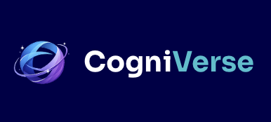
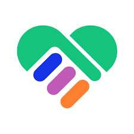
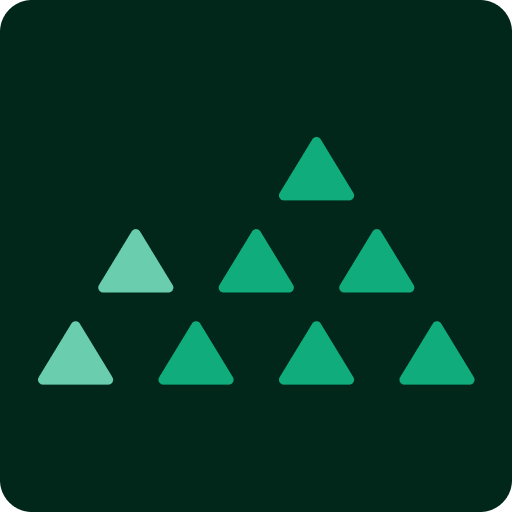

# Hi there, I'm a Senior Android Engineer! 👋

A highly motivated, detail-oriented **Senior Mobile Application Engineer (Android)** with **10+ years of professional experience** in software development. 

I excel in fast-paced environments, adapting quickly to evolving project requirements, and leading cross-functional teams to deliver high-quality products. Whether collaborating within large teams or working with minimal supervision, I consistently perform well under pressure, meeting tight deadlines and maintaining exceptional technical and architectural standards.

While my deep expertise lies in the **Android ecosystem**, I also bring **intermediate exposure to web development** and a **beginner foundation in iOS development**, allowing me to easily bridge the gap across cross-platform engineering initiatives.

---

### 🧰 Tech Stack & Expertise

* **Mobile (Expert):** Android SDK, Kotlin, Java, Jetpack Compose, Coroutines/Flow, Dagger/Hilt, Architecture Components (MVVM/MVI), Clean Architecture.
* **Mobile (Beginner):** iOS Development, Swift, UIKit.
* **Web (Intermediate):** JavaScript/TypeScript, React.js, Express.js, Node.js, C# .NET, MongoDB.
* **Methodologies & Tools:** Agile/Scrum, CI/CD pipelines, Git, Team Leadership & Mentoring.

---

### 🚀 Highlighted Projects

*Here is a selection of projects I have designed, engineered, or contributed to significantly over my career.*

#### 💻 Resource Management Web App

**Role:** Senior Software Engineer  
**Tech Stack:** Typescript, React.js, Express.js, Node.js, MongoDB

Internal tool for resource management, to be used by a multinational organization.

* 🔗 **Links:** N/A Internal

---

#### 📱 Airlines App

**Role:** Senior Software Engineer  
**Tech Stack:** Java, Kotlin, Typescript, React.js, C# .NET, Azure

Streamlines your travel by allowing you to easily book flights with cash or points, track rewards, check in, and receive real-time updates for a hassle-free airport experience.

* 🔗 **Links:** [Google Play Store](https://play.google.com/store/apps/details?id=com.alaskaairlines.android)

---

#### 📱 Social App

**Role:** Senior Android Developer  
**Tech Stack:** Java, Kotlin

Designed for pharmacy professionals, join discussions, keep up with the latest announcements from your association and see the latest news from the pharma practice.

* 🔗 **Links:** [Google Play Store](https://play.google.com/store/apps/details?id=com.swiperx)

---

#### 📱 Fitness App

**Role:** Mid Android Developer  
**Tech Stack:** Kotlin

Offers personalized home and gym training plans tailored to your specific goals and skill level, featuring the first-ever HYROX-certified training program to help improve your strength, endurance, and physique.

* 🔗 **Links:** [Google Play Store](https://play.google.com/store/apps/details?id=com.centr.app)

---

#### 📱 Gym Access and Management App

**Role:** Mid Android Developer  
**Tech Stack:** Kotlin

Serves as an all-access pass for members to seamlessly manage their accounts, find locations, book classes, explore personal trainers, and freeze memberships anytime, anywhere across Australia.

* 🔗 **Links:** [Google Play Store](https://play.google.com/store/apps/details?id=com.flg.kubofitapp.ff)

---

#### 📱 Cryptocurrency Exchange App

**Role:** Mid Android Developer  
**Tech Stack:** Kotlin

Australia's leading digital asset and cryptocurrency exchange.

* 🔗 **Links:** [Google Play Store](https://play.google.com/store/apps/details?id=com.btcmarket.btcm)

---

#### 📱 IoT App

**Role:** Mid Android Developer  
**Tech Stack:** Java, Kotlin

 IoT (Internet of Things). Supports connectivity via Wi-Fi, Bluetooth, ZigBee, GPRS Embedded Modules for any devices (smart plugs, door & window sensors, smart smoke sensors, smart motion sensors, etc).

* 🔗 **Links:** [Google Play Store](https://play.google.com/store/apps/details?id=com.btcmarket.btcm)

---

#### 📱 Insurance Proposal App

**Role:** Android Developer  
**Tech Stack:** Java, Realm DB

Enables users to seamlessly create, present, and sync life insurance proposals online or offline, complete with visual data plotting, PDF generation, and digital signature capture.

* 🔗 **Links:** N/A Internal

---

#### 📱 Healthcare App

**Role:** Android Developer  
**Tech Stack:** Java

All-in-one health companion that lets you instantly locate nearby accredited hospitals and clinics using an interactive map, request medical authorizations, and connect with a doctor anytime.

* 🔗 **Links:** [Google Play Store](https://play.google.com/store/apps/details?id=ph.com.toplogic.generalimobilekit)

---

### 📫 Let's Connect!
* 💼 **LinkedIn:** [/in/kevin-guido](https://www.linkedin.com/in/kevin-guido-77832414b)
* 📧 **Email:** [kevindeveza.guido@gmail.com](mailto:kevindeveza.guido@gmail.com)
